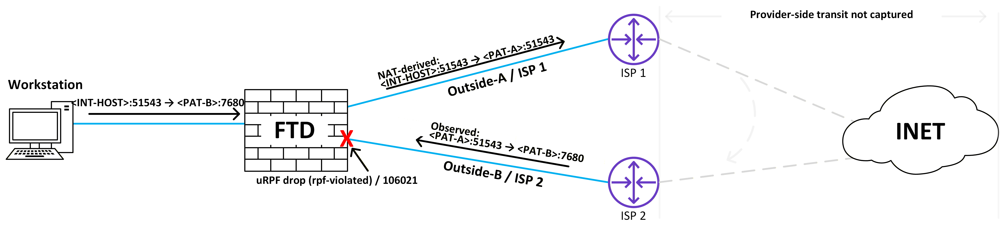
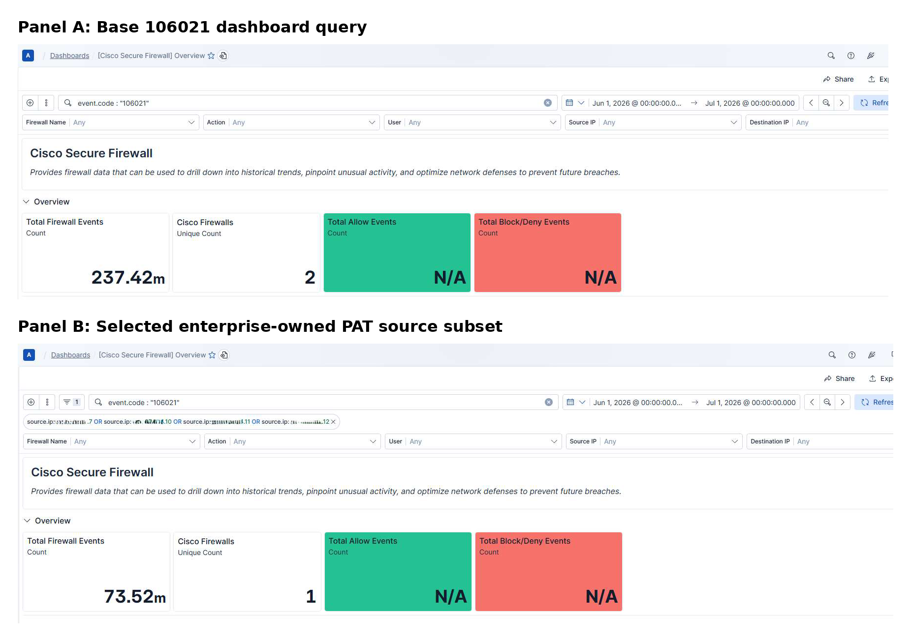
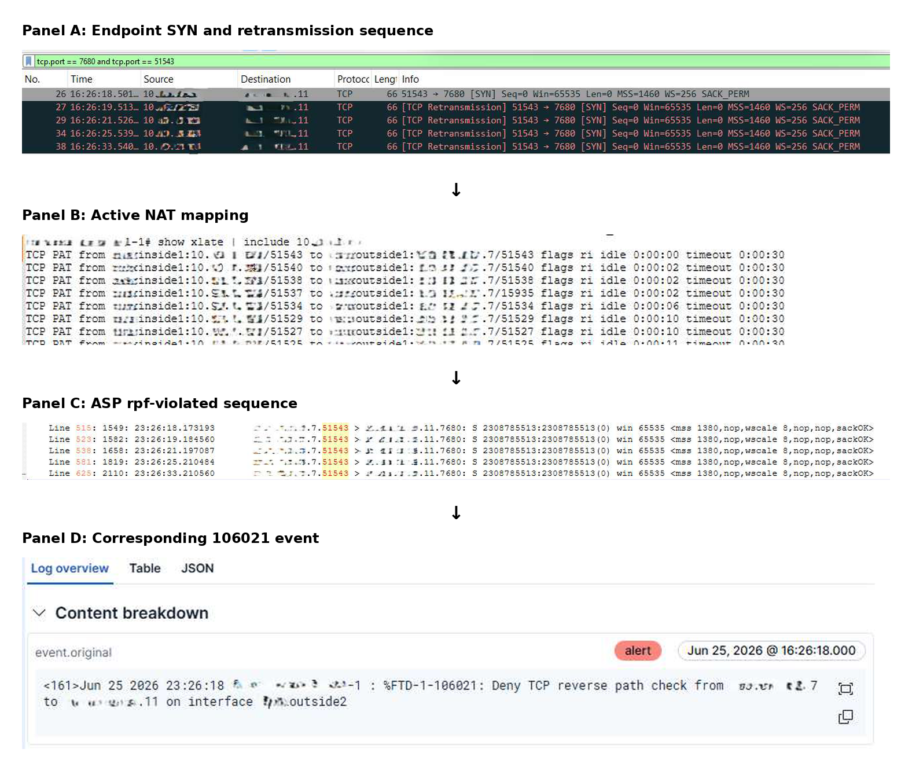
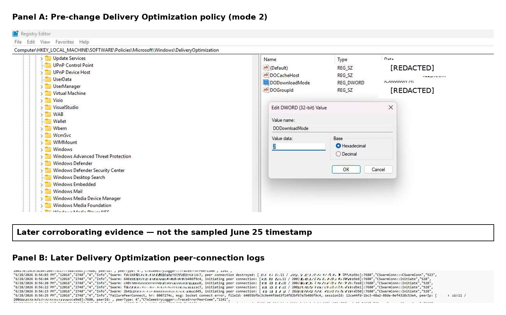
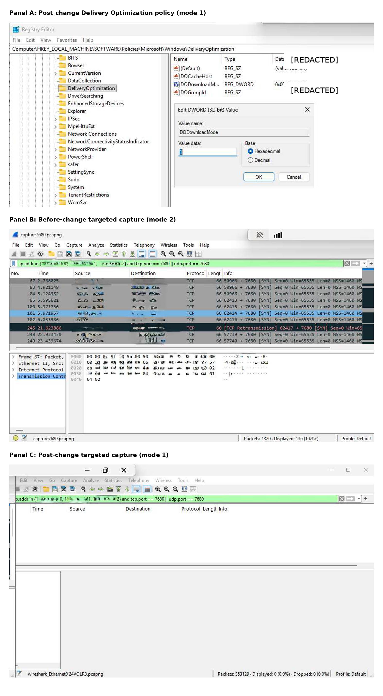

# How Multi-Plane Telemetry Isolated a 73-Million-Event Pattern Inside a 237-Million-Event uRPF Storm

## Correlating Cisco Secure Firewall 106021 events, NAT state, endpoint captures, and Windows Delivery Optimization telemetry

<!-- PUBLICATION MASTER v1.0 PRODUCTION NOTE: Figures are linked with relative paths in publication_assets/. Keep the Markdown file and that folder together, or replace each path with the final hosted image URL. Complete the remaining timestamp-source and disclosure checks before external submission. -->

A Cisco Secure Firewall `106021` event tells an engineer that a packet failed reverse-path validation. It does not necessarily identify the endpoint that generated the packet, the application responsible for it, or the complete path that brought it to the receiving interface.

That distinction became important during an investigation into about **237.4 million** Cisco Secure Firewall `106021` records reported by an Elastic-based firewall dashboard during the 30-day window from June 1, 2026, at 00:00 through July 1, 2026, at 00:00. Applying a `source.ip` filter for the selected enterprise-owned PAT address group returned about **73.5 million** records concentrated on one of the two firewalls represented in the base result.

At first glance, the relationship between enterprise-owned public PAT addresses looked consistent with persistent asymmetric routing or externally spoofed traffic.

The Layer 3 syslog evidence was not sufficient to distinguish between those explanations.

The investigation therefore correlated evidence across several planes:

- Cisco `106021` events
- Accelerated Security Path (ASP) drop captures
- Active NAT translations
- Endpoint packet captures
- Delivery Optimization configuration
- Delivery Optimization application logs
- Post-change endpoint validation

For a sampled TCP/7680 flow, the endpoint capture, NAT state, ASP capture, and firewall event formed a direct evidence chain. The firewall-side records were displayed in UTC, while the workstation capture displayed Pacific Daylight Time (PDT, UTC−7). After UTC-to-PDT normalization, the endpoint and ASP captures showed the same retransmission pattern with a stable residual offset of approximately 328–329 milliseconds. The firewall-management platform and workstation were synchronized to the same enterprise NTP service; because the complete timestamp-production path from the FTD/Lina sensor through the management platform was not independently measured, the residual is treated as a capture-point or timestamping offset. Later Delivery Optimization logs corroborated the application behavior, although the original application ETL data for the sampled date was no longer available.

A subsequent policy change moved Windows Delivery Optimization from download mode `2` to mode `1`. In the post-change capture, no traffic matched the previously observed enterprise-public-address and port-7680 pattern.

The investigation established the cause of sampled and repeatedly correlated TCP/7680 flows. It did not independently attribute every record in the full dashboard population.

The article’s primary contribution is therefore not a population-wide claim about Windows Delivery Optimization. It is a reusable multi-plane method for tracing an opaque firewall event through translation state to the originating endpoint and application behavior.

---

## 1. The Visibility Problem

A sanitized Cisco Secure Firewall event may resemble the following:

```text
Deny TCP reverse path check from <PAT-A>
to <PAT-B> on interface Outside-B
```

The event establishes several useful facts:

- A TCP packet arrived on the identified external interface.
- The apparent source was `<PAT-A>`.
- The destination was `<PAT-B>`.
- The packet failed reverse-path validation.
- The firewall dropped it.

However, the event does not answer several questions required for root-cause analysis:

- What were the source and destination ports?
- Was the packet associated with an active NAT translation?
- Did an internal endpoint generate the original connection?
- Which application owned the connection?
- Why was one enterprise public address attempting to reach another?
- Which path brought the translated packet back to the external interface?
- Was the event caused by application behavior, routing, NAT, spoofing, or a firewall defect?

The event describes an enforcement decision. It is not a complete explanation of the traffic.

This becomes especially important when the apparent source is an address owned by the same organization. A public PAT address can represent many internal sessions. Without translation and endpoint context, the public address alone does not identify the originating system.

Cisco lists `106021` as the Secure Firewall Threat Defense message for a protocol reverse-path-check denial. Cisco's more detailed ASA message explanation associates the event with a source route that is absent or does not resolve through the receiving interface ([Cisco FTD syslog catalog](https://www.cisco.com/c/en/us/td/docs/security/firepower/Syslogs/fptd_syslog_guide/syslogs-sev-level.html); [Cisco ASA message 106021](https://www.cisco.com/c/en/us/td/docs/security/asa/syslog/asa-syslog/syslog-messages-101001-to-199021.html)). Cisco's ASP drop reference similarly defines `rpf-violated` as a route lookup for the source IP that does not return the interface on which the packet arrived ([Cisco, *show asp drop Command Usage*](https://www.cisco.com/c/en/us/td/docs/security/asa/asa-cli-reference/show_asp_drop_command_usage/show-asp-drop-command-usage.html#rpf-violated)).

Reverse-path filtering is an important anti-spoofing control, but strict validation can require careful interpretation in multihomed environments because legitimate path asymmetry may affect the interface check ([RFC 3704, *Ingress Filtering for Multihomed Networks*](https://www.rfc-editor.org/rfc/rfc3704.html)). The presence of `106021` therefore identifies a failed validation decision; it does not, by itself, identify the originating application or prove the broader root cause.

## 2. The Multi-Plane Correlation Method

The investigation used evidence from three primary planes and connected them through a normalized timeline.

```text
+--------------------------+     +--------------------------+     +--------------------------+     +--------------------------+
|      SECURITY PLANE      |     |    TRANSLATION PLANE     |     |       ENDPOINT PLANE     |     |  NORMALIZED EVENT TIME   |
|                          |     |                          |     |                          |     |                          |
| - 106021 event           |     | - NAT/PAT mapping        |     | - Host packet capture    |     | Tuple + flags + cadence  |
| - ASP drop capture       | --> | - Local and global ports | --> | - Application logs       | --> | + observation window     |
| - Ingress interface      |     | - Internal source        |     | - Registry/policy state  |     |                          |
| - Drop reason            |     | - Translation state      |     | - Process or service     |     |                          |
| - Translated packet      |     |                          |     |                          |     |                          |
+--------------------------+     +--------------------------+     +--------------------------+     +--------------------------+
```

Each plane answers a different question.

### Security plane

The security plane identifies where enforcement occurred and exposes the packet attributes available at the point of the drop.

### Translation plane

The translation plane maps the apparent public source and translated port back to an internal endpoint and local socket.

### Endpoint plane

The endpoint plane confirms that the host generated the connection and provides the configuration or application evidence needed to explain why.

### Normalized timeline

Timestamp normalization establishes whether the observations from the three planes belong to the same connection sequence. Exact timestamp equality is not required. A stable offset combined with matching tuples, sequence behavior, and retransmission cadence can provide stronger evidence than an unsupported claim of perfect clock alignment.

The method does not treat any single data source as sufficient. It relies on agreement among independent evidence sources and documents what each source can and cannot prove.

---

## 3. Sanitized Environment and Investigative Question

The case involved an enterprise perimeter with multiple public PAT addresses serving different internal network groups.

<!-- FIGURE 1 REFERENCE PLACEHOLDER -->


*Figure 1 — Sanitized topology and evidence-bounded packet path. Endpoint evidence establishes the original TCP connection from `<INTERNAL-HOST>:51543` to `<PAT-B>:7680`. NAT state associates that socket with the translated public source `<PAT-A>:51543`, and ASP evidence shows the translated SYN appearing on `Outside-B` toward `<PAT-B>:7680`, where it fails reverse-path validation. The intermediate provider-side transit was not captured and is intentionally shown as an unobserved segment.*

In this model:

- `<PAT-A>` represents the public address used to translate the source endpoint.
- `<PAT-B>` represents an enterprise-owned public address selected as the destination.
- `<INTERNAL-HOST>` represents the originating Windows endpoint.
- TCP `7680` represents the observed destination service.

The exact provider-side path was not captured. Figure 1 therefore represents the logical packet sequence supported by endpoint, NAT, and firewall evidence rather than claiming visibility into every external hop.

The investigative question was:

> Why would an internal connection translated behind `<PAT-A>` attempt to reach `<PAT-B>`, and why would the translated packet fail reverse-path validation when it appeared on an external ingress interface?


### Environment versions

- Cisco Secure Firewall 7.6.4 managed by FMC 7.6.5 (build 106)
- Windows 11 Enterprise 25H2 (build 26200.8457)
- Delivery Optimization configured through Group Policy

<!-- AUTHOR VERIFICATION PLACEHOLDER: Confirm whether the FTD/Lina sensor that produced the ASP timestamps was synchronized to the same enterprise NTP source as the workstation. If confirmed, replace the cautious timestamp-source wording in Sections 6 and A.4 with “The FTD sensor and workstation were synchronized to the same enterprise NTP service.” Add exact minor releases where disclosure is permitted. -->


## 4. Initial Explanations Considered

Several explanations were considered at the beginning of the investigation.

| Possible explanation | Evidence that would support it |
|---|---|
| External source-address spoofing | No corresponding internal connection, endpoint packet, or NAT state |
| Legitimate traffic returning through an unexpected path | A valid connection accompanied by route or interface inconsistency |
| Internally generated traffic targeting an enterprise public address | Matching endpoint traffic and active NAT translation |
| Application-driven peer discovery | Repeated application port, endpoint configuration, and application-log evidence |
| Firewall, NAT, or routing defect | Processing inconsistent with configured routing or repeatable packet behavior |

The goal was not to select the most plausible explanation immediately. It was to determine which explanation best accounted for the packet across all available evidence planes.

---

## 5. Applying the Method

### 5.1 Profile the event population

The Elastic-based Cisco Secure Firewall dashboard reported about **237.4 million** `106021` records during the 30-day window from June 1, 2026, at 00:00 through July 1, 2026, at 00:00. The base result represented two firewalls.

The investigation then added a `source.ip` filter containing the selected enterprise-owned PAT address group. The filtered result returned about **73.5 million** records and was concentrated on one firewall. No destination-IP criterion was included in this subset. The filtered count represented about 31% of the base dashboard result, but that percentage describes dashboard concentration, not causal attribution.

This concentration was operationally significant. It showed that a substantial part of the reverse-path event population involved packets whose apparent source matched one of a small number of enterprise-owned translated addresses. It did not establish that every record in either result shared the same cause.

#### Event-count method

The population was measured from the **Cisco Secure Firewall Overview** dashboard. The base query was:

```text
event.code : "106021"
```

The enterprise-PAT subset was produced by adding a dashboard filter that ORed the selected PAT addresses in the `source.ip` field. The displayed time range was June 1, 2026, at 00:00 through July 1, 2026, at 00:00.

The dashboard displayed `237.42m` total records for the base query and `73.52m` after the source-IP filter was applied. These are dashboard-reported values. The screenshots do not independently establish the underlying Elastic data view, raw-document versus dashboard-aggregation behavior, or duplicate-ingestion treatment.

<!-- FIGURE 2 REFERENCE PLACEHOLDER -->


*Figure 2 — Dashboard-reported `106021` population and enterprise-PAT source subset. The June 1-to-July 1 base query returned `237.42m` records across two firewalls. Applying the selected enterprise-owned PAT-address filter to `source.ip` returned `73.52m` records concentrated on one firewall. Counts are dashboard-reported values and were not independently deduplicated at the raw-document level.*

Event volume alone did not establish root cause. A large number of similar logs can result from:

- One endpoint repeatedly retransmitting
- Many endpoints running the same application
- A common endpoint policy deployed across a fleet
- A routing fault affecting repeated sessions
- Automated scanning or source spoofing
- A distributed peer-discovery mechanism

The volume justified investigation, but it did not prove asymmetry.

**What this step established**

- The condition was persistent.
- The selected enterprise-owned PAT source subset accounted for a substantial part of the dashboard result.
- The pattern was structured enough to support targeted packet capture.

**What this step did not establish**

- Which internal endpoints were involved
- The destination service
- Whether the traffic was malicious
- Whether the condition was caused by routing

### 5.2 Recover the missing transport context

Because the standard event did not provide enough Layer 4 context, an ASP drop capture was collected for packets associated with the reverse-path failure. Cisco documents `asp-drop` captures as a way to collect packets discarded by the Accelerated Security Path and allows a specific drop code to be supplied as the capture type ([Cisco, *Configure ASA Packet Captures with CLI and ASDM*](https://www.cisco.com/c/en/us/support/docs/security/asa-5500-x-series-next-generation-firewalls/118097-configure-asa-00.html); [Cisco `capture` command reference](https://www.cisco.com/c/en/us/td/docs/security/asa/asa-cli-reference/A-H/asa-command-ref-A-H/ca-cld-commands.html)).

The capture revealed a consistent pattern:

```text
<PAT-A>:<changing-source-port> > <PAT-B>:7680
TCP SYN
Drop reason: rpf-violated
```

The source port changed across connection attempts, but the destination port remained TCP `7680`.

This changed the direction of the investigation. A repeated destination port suggested a specific service or application workflow rather than arbitrary Layer 3 traffic. It did not, by itself, eliminate asymmetric routing. An application flow can still experience an asymmetric path. The port pattern provided a lead, not proof.

**What this step established**

- The captured packets were TCP SYN attempts.
- TCP port `7680` was consistently involved in the sampled pattern.
- The transport tuple could be used as a cross-plane correlation key.

**What this step did not establish**

- Which internal endpoint generated the connection
- Whether PAT preserved the original source port
- Whether every record in the full dashboard population used TCP/7680
- Which application selected the destination

### 5.3 Correlate the packet with NAT state

The next step was to compare the translated packet attributes with active firewall translation state.

The correlation used the available combination of:

- Protocol
- Translated source address
- Translated source port
- Private source address
- Local source port
- Destination address
- Destination port
- Observation window

For the sampled flow, the translation state showed:

```text
Inside local:   <INTERNAL-HOST>:51543
Inside global:  <PAT-A>:51543
State:          active during collection
Idle:           0:00:00
Timeout:        0:00:30
```

In this sample, the firewall preserved the endpoint’s original source port. PAT does not guarantee port preservation. The local and translated ports must be treated as separate values unless the translation explicitly shows that they are identical.

The NAT output did not contain an exact translation-creation timestamp. Its evidentiary value is therefore limited to showing that the mapping was active during the collection window and connected the private endpoint to the apparent public source in the ASP capture.

**What this step established**

- The active translation associated the sampled public tuple with a specific internal endpoint and local socket.
- The apparent public source represented an active PAT translation.
- The sampled packet could be mapped to a specific private endpoint and socket.

**What this step did not establish**

- Which application owned the socket
- Whether all events came from the same endpoint
- Whether every event involving the PAT addresses had the same cause

### 5.4 Capture the endpoint traffic

Once the private address was identified, a packet capture was performed on the endpoint.

The endpoint capture showed:

- An initial TCP SYN toward `<PAT-B>:7680`
- Local source port `51543`
- Four TCP SYN retransmissions
- A retry progression of approximately 1, 2, 4, and 8 seconds
- Timing consistent with the ASP sequence after converting the firewall’s UTC timestamps to the workstation’s PDT display timezone

The endpoint capture independently confirmed that the private host initiated the connection. It established the packet before translation rather than relying only on the public representation seen by the firewall.

**What this step established**

- The endpoint generated the sampled TCP/7680 connection.
- The local socket matched the active NAT mapping.
- Retransmissions contributed multiple firewall drops for one failed connection attempt.

**What this step did not establish**

- Which Windows component owned the socket
- How the public address was selected as a peer
- Whether the destination was expected to be local or remote

---

## 6. Correlated Sample Timeline

The following table reconstructs one sampled connection. Addresses are represented by functional labels, while the observed timestamps and ports are retained.

| Evidence source | Normalized timestamp | Source tuple | Destination tuple | Observation |
|---|---:|---|---|---|
| `106021` syslog | `16:26:18.000` | `<PAT-A>`; source port not recorded | `<PAT-B>`; destination port not recorded | Reverse-path-check denial recorded on the external interface. Timestamp resolution is one second. |
| ASP drop capture (UTC converted to PDT) | `16:26:18.173193` | `<PAT-A>:51543` | `<PAT-B>:7680` | TCP SYN with sequence `2308785513` dropped with `rpf-violated`. |
| NAT state | No creation timestamp shown | `<INTERNAL-HOST>:51543` mapped to `<PAT-A>:51543` | Destination not shown in the displayed xlate entry | Translation was active during collection with `idle 0:00:00` and `timeout 0:00:30`. |
| Endpoint capture | `16:26:18.501` | `<INTERNAL-HOST>:51543` | `<PAT-B>:7680` | Initial TCP SYN, displayed with relative sequence number `0`. |

The SYN flag and sequence-number terminology in the packet evidence follow the TCP specification in [RFC 9293](https://www.rfc-editor.org/rfc/rfc9293.html).

The firewall-side timestamps were recorded in UTC, while the workstation packet capture displayed PDT, or UTC−7, on the collection date. Converting the firewall timestamps from UTC to PDT aligned the five corresponding SYN attempts. The firewall-management platform and workstation were synchronized to the same enterprise NTP service. A consistent residual difference of approximately 328–329 milliseconds remained between the ASP and endpoint timestamps. Because the complete timestamp-production path from the FTD/Lina sensor through the management platform was not independently measured, the residual is treated as a capture-point or timestamping offset rather than packet transit time. The matching tuples, port mapping, TCP state, and retransmission intervals provide the stronger basis for correlating the records.

### 6.1 Retransmission-sequence comparison

| Attempt | Endpoint capture | Normalized ASP capture | Approximate offset |
|---:|---:|---:|---:|
| Initial SYN | `16:26:18.501` | `16:26:18.173193` | `0.328 s` |
| Retry 1 | `16:26:19.513` | `16:26:19.184560` | `0.328 s` |
| Retry 2 | `16:26:21.526` | `16:26:21.197087` | `0.329 s` |
| Retry 3 | `16:26:25.539` | `16:26:25.210484` | `0.329 s` |
| Retry 4 | `16:26:33.540` | `16:26:33.210560` | `0.329 s` |

The retry intervals also aligned:

| Interval | Endpoint capture | ASP capture |
|---|---:|---:|
| Initial to retry 1 | approximately `1.012 s` | approximately `1.011 s` |
| Retry 1 to retry 2 | approximately `2.013 s` | approximately `2.013 s` |
| Retry 2 to retry 3 | approximately `4.013 s` | approximately `4.013 s` |
| Retry 3 to retry 4 | approximately `8.001 s` | approximately `8.000 s` |

After converting the firewall’s UTC timestamps to the workstation’s PDT display timezone, the endpoint and ASP captures showed the same five-attempt TCP SYN sequence. Corresponding packets retained a stable 328–329 ms residual timestamp offset, while their retransmission intervals aligned at approximately one, two, four, and eight seconds. The seven-hour difference was attributable to timezone display rather than clock drift. The residual offset was not interpreted as network latency; correlation rested on the matching tuple, TCP state, port mapping, observation window, and retransmission cadence.

The matching cadence is stronger evidence than a claim of exact zero-millisecond alignment.

### 6.2 How the flow was correlated

The flow was associated across the evidence sources using:

- TCP as the transport protocol
- The private endpoint address
- Local source port `51543`
- Translated `<PAT-A>`
- Translated source port `51543`
- `<PAT-B>`
- Destination port `7680`
- TCP SYN state
- Repeated retransmission behavior
- The common observation window
- The consistent residual timestamp offset after UTC-to-PDT normalization

The `106021` event did not contain ports. It was therefore supporting same-window enforcement evidence rather than an independently complete flow record. The ASP capture supplied the missing Layer 4 tuple.

<!-- FIGURE 3 REFERENCE PLACEHOLDER -->


*Figure 3 — Cross-plane correlation for one sampled TCP/7680 flow. Panel A shows the endpoint SYN and retransmission sequence; Panel B shows the active NAT mapping; Panel C shows the corresponding translated ASP sequence; and Panel D shows the `106021` enforcement event. After UTC-to-PDT normalization, the endpoint and ASP SYN sequences maintained an approximately 328–329 ms residual offset and matching one-, two-, four-, and eight-second retry cadence. The syslog provides Layer 3 enforcement context but does not contain port information. The figure supports correlation for the sampled flow; it does not attribute the full dashboard population.*

---

## 7. Evidence Classification

Not all evidence in the investigation carries the same weight or refers to the same moment.

| Classification | Evidence | What it establishes | Limitation |
|---|---|---|---|
| **Direct same-flow evidence** | Endpoint SYN and retransmissions from `<INTERNAL-HOST>:51543` to `<PAT-B>:7680` | The endpoint initiated the sampled connection | Does not independently identify the application |
| **Direct same-flow evidence** | Active NAT mapping from `<INTERNAL-HOST>:51543` to `<PAT-A>:51543` | Links the private endpoint to the apparent public source in the ASP capture | No creation timestamp is shown |
| **Direct same-flow evidence** | ASP SYNs from `<PAT-A>:51543` to `<PAT-B>:7680`, dropped as `rpf-violated` | Shows the translated packet and enforcement result | Does not show the original private address |
| **Direct contextual evidence** | Corresponding `106021` event for `<PAT-A>` to `<PAT-B>` | Shows the firewall’s reverse-path enforcement event | Does not include ports or full TCP context |
| **Configuration evidence** | Pre-change `DODownloadMode = 2` | Confirms Delivery Optimization group mode was configured | Configuration alone does not prove ownership of one socket |
| **Application-attribution evidence** | Delivery Optimization logs showing peer attempts toward the same public-address group on TCP/7680 | Corroborates the Delivery Optimization peer behavior | Logs are from a later date, not the exact sampled connection |
| **Intervention evidence** | `DODownloadMode` changed to `1` | Confirms the intended peer-scope change | Does not by itself demonstrate traffic impact |
| **Post-change validation** | Zero matches in the targeted post-change capture | Shows the previously observed pattern was absent during that capture | Does not establish permanent or enterprise-wide elimination |
| **Inference** | The public address was learned or received as a Delivery Optimization peer candidate | Best explains why the endpoint selected an enterprise public address | The complete cloud peer-list exchange was not captured |
| **Unavailable evidence** | Original incident-date Delivery Optimization ETL | Would have provided same-time application evidence | The ETL data had been overwritten |
| **Unavailable evidence** | Complete provider-side packet path | Would show every external hop and re-entry path | Not captured |
| **Unavailable evidence** | Long-term SIEM event comparison | Would quantify the proportion of the broader storm removed | Not yet completed |

---

## 8. Identifying the Application

TCP port `7680` provided an investigative lead, but a known destination port was not treated as proof of application ownership.

Microsoft documents TCP `7680` as the peer-to-peer content-sharing port used by Windows Delivery Optimization ([Microsoft, *Configure Delivery Optimization for Windows*](https://learn.microsoft.com/en-us/windows/deployment/do/delivery-optimization-configure); [Microsoft, *How Delivery Optimization works*](https://learn.microsoft.com/en-us/windows/deployment/do/delivery-optimization-workflow)). In the policy model used for this environment, mode `1` limited peering to the LAN scope, while mode `2` allowed peering within the configured Delivery Optimization group. Microsoft's current reference describes LAN mode as peer sharing among devices treated as being on the same network, commonly identified through the same public IP/NAT context, while Group mode can permit peering across internal subnets among devices assigned to the same group ([Microsoft, *Delivery Optimization reference*](https://learn.microsoft.com/en-us/windows/deployment/do/waas-delivery-optimization-reference)). Group membership and peer scope can be influenced by `DOGroupID`, `DOGroupIDSource`, and peer-selection restrictions ([Microsoft, *Policy CSP — DeliveryOptimization*](https://learn.microsoft.com/en-us/windows/client-management/mdm/policy-csp-deliveryoptimization)).

Application attribution in this case relied on the combined evidence:

- The endpoint initiated repeated TCP/7680 connections.
- The pre-change registry showed `DODownloadMode = 2`.
- A Delivery Optimization Group ID was configured.
- Delivery Optimization logs showed the service initiating peer connections toward the same enterprise public-address group on TCP/7680.
- The public-address/7680 pattern appeared in the before-change endpoint capture.
- The pattern was absent from the post-change capture after `DODownloadMode` changed to `1`.

The correlated packet sample occurred on June 25. The available Delivery Optimization records were collected on June 28 because the original ETL data for the sampled date had been overwritten. The later records therefore corroborate the same behavior pattern but are not part of the exact timestamp chain for the sampled connection.

The available log excerpt included repeated Delivery Optimization messages such as `initiating peer connection` toward the enterprise-owned public addresses on port `7680`.

The combined evidence strongly supports Windows Delivery Optimization as the source of the sampled connection pattern. It does not show the complete cloud-side peer-selection exchange.

The best-supported explanation is that the endpoint learned or received the enterprise public address as a Delivery Optimization peer candidate. The investigation did not directly capture the cloud service returning that address.

<!-- FIGURE 4 REFERENCE PLACEHOLDER -->


*Figure 4 — Delivery Optimization configuration and later corroborating application evidence. Panel A confirms the pre-change mode-2 policy. Panel B shows later Delivery Optimization records containing peer-connection attempts toward the same enterprise-owned public-address group on TCP/7680. The application records are from June 28 and are corroborating evidence, not part of the exact June 25 sampled-flow timestamp chain.*

## 9. Reconstructing the Sampled Packet Lifecycle

The sampled flow can be described without asserting an unobserved provider-side route.

1. **Observed at the endpoint:** The internal host sent a TCP SYN from local source port `51543` to an enterprise-owned public address on destination port `7680`.

2. **Observed in NAT state:** The firewall had an active mapping from the private endpoint and local port to `<PAT-A>` and translated port `51543`.

3. **Observed in the ASP capture:** A SYN from `<PAT-A>` and port `51543` appeared on the external ingress path toward `<PAT-B>` on port `7680`.

4. **Observed in firewall enforcement:** The translated SYN failed reverse-path validation and was recorded as `rpf-violated`. A corresponding `106021` event identified the same public source, public destination, and external interface.

5. **Observed at the endpoint:** The endpoint retransmitted the SYN because the connection did not complete. Four retries followed an approximate 1-, 2-, 4-, and 8-second progression.

6. **Strongly supported by combined evidence:** Windows Delivery Optimization generated the public-address peer-connection pattern.

7. **Inferred:** Delivery Optimization peer-selection logic caused the enterprise public address to be selected as a candidate peer.

The complete provider-side route between external egress and external re-entry was not captured. The article therefore describes external re-entry as observed at the firewall rather than claiming a particular ISP traversal sequence.

---

## 10. Evaluating the Initial Explanations

| Explanation | Assessment |
|---|---|
| **External spoofing** | Rejected for the correlated sample because the apparent public source was mapped through active NAT state to the endpoint that generated the SYN sequence |
| **Persistent asymmetric routing as the source of the connection attempt** | The sampled sequence began as an endpoint-generated Delivery Optimization connection. The evidence therefore did not support persistent asymmetric routing as the source of the connection attempt or the primary explanation for the repeated TCP/7680 pattern. The complete external transit path was not captured. |
| **Routing loop** | Not supported; no repeating routed circulation or TTL-decrement sequence was demonstrated |
| **Firewall defect** | Not supported; ASP and syslog evidence showed repeatable reverse-path enforcement consistent with the configured behavior |
| **Delivery Optimization peer behavior** | Best-supported explanation based on endpoint traffic, NAT correlation, configuration, later application logs, and post-change disappearance of the targeted pattern |

This assessment does not establish that asymmetric routing was absent from every record in the dashboard observation window. It establishes that the sampled connection was endpoint-generated and that persistent asymmetry was not the best-supported primary explanation for the repeated TCP/7680 pattern.

## 11. Root Cause

For the sampled and correlated flows, an internal Windows endpoint initiated Delivery Optimization peer connections to enterprise-owned public PAT addresses over TCP/7680. Active NAT state mapped the endpoint socket to the apparent public source in the ASP capture, where the translated SYN failed reverse-path validation and generated the associated `106021` context.

After `DODownloadMode` changed from `2` to `1`, the targeted public-address/7680 pattern was absent from the post-change endpoint capture. This intervention strengthens the conclusion that Delivery Optimization peer scope drove the sampled connection pattern. It does not prove that every record in the full dashboard population had the same origin.

## 12. Operational Response

The corrective action should target the source behavior rather than weaken reverse-path protection.

### 12.1 Correct peer-discovery scope

Review Delivery Optimization settings including:

- `DODownloadMode`
- `DOGroupID`
- `DOGroupIDSource`
- `DORestrictPeerSelectionBy`
- Server and workstation policy separation
- Site and subnet boundaries
- Connected Cache design

In the tested case, `DODownloadMode` was changed from group mode (`2`) to LAN mode (`1`). In the policy model used for this environment, that change narrowed peering from the configured Delivery Optimization group to LAN-scoped peer selection. Microsoft documents that mode `1` and mode `2` create different peer scopes and that Group ID and Group ID source settings affect mode `2` membership ([Microsoft Delivery Optimization configuration guidance](https://learn.microsoft.com/en-us/windows/deployment/do/delivery-optimization-configure); [Microsoft Delivery Optimization policy reference](https://learn.microsoft.com/en-us/windows/client-management/mdm/policy-csp-deliveryoptimization)).

### 12.2 Validate expected update behavior

Confirm that narrowing peer scope does not adversely affect:

- Windows update delivery
- Content-download performance
- WAN utilization
- Cache utilization
- Update completion rates

The objective is to eliminate unusable peer relationships without degrading the update-distribution design.

### 12.3 Measure the affected event population

Track:

- `106021` events involving the affected PAT addresses
- TCP/7680 ASP drops
- Unique internal endpoints involved
- Event volume before and after the change
- Residual events that do not match the documented pattern

### 12.4 Preserve uRPF

Reverse-path enforcement should remain enabled unless a documented network design requires a different validation mode. The firewall was rejecting packets whose source-route lookup did not satisfy the receiving-interface check described for `rpf-violated` and `106021` ([Cisco ASP drop reference](https://www.cisco.com/c/en/us/td/docs/security/asa/asa-cli-reference/show_asp_drop_command_usage/show-asp-drop-command-usage.html#rpf-violated); [Cisco message 106021](https://www.cisco.com/c/en/us/td/docs/security/asa/syslog/asa-syslog/syslog-messages-101001-to-199021.html)). RFC 3704 discusses strict, feasible-path, and loose RPF approaches for multihomed networks; any mode change should follow documented topology requirements rather than serve as an alert-suppression shortcut ([RFC 3704](https://www.rfc-editor.org/rfc/rfc3704.html)).

### 12.5 Treat edge filtering as secondary

A narrowly scoped edge control may be justified in some environments, but it should not replace correction of endpoint peer-selection behavior. Filtering can suppress traffic or evidence without addressing why endpoints are selecting unusable public peer addresses.

---

## 13. Post-Change Validation

The Delivery Optimization policy on the sampled endpoint was changed from:

```text
DODownloadMode = 2
```

To:

```text
DODownloadMode = 1
```

The post-change registry evidence confirmed the value `0x00000001 (1)`.

The before-change and post-change packet captures used the same visible Wireshark display-filter expression against the enterprise public PAT addresses and TCP/UDP port `7680`. Future validation should use explicit parentheses so the address restriction clearly applies to both the TCP and UDP conditions. The full expression and precedence note are retained in Appendix A.7 rather than interrupting the intervention narrative.

### 13.1 Before-and-after result

| Condition | Delivery Optimization mode | Total captured packets | Target-pattern matches |
|---|---:|---:|---:|
| Before change | `2` | `1,320` | `136` |
| After change | `1` | `353,129` | `0` |

The original full-resolution Wireshark status bar shows `353,129` total packets in the post-change capture. Although the post-change capture contained substantially more overall traffic, capture duration, workload, and active Delivery Optimization download conditions were not controlled or documented. The two rows therefore must not be interpreted as normalized rates or directly comparable percentages.

The defensible conclusion is:

> No traffic matching the previously observed public-address and port-7680 pattern was observed during the post-change capture.

This result supports the conclusion that Delivery Optimization peer scope was responsible for the sampled public-address connection pattern.

It does not prove that:

- Every endpoint received the policy change
- The pattern was permanently eliminated
- All `106021` events were removed
- Delivery Optimization activity was identical during both captures
- The broader dashboard population had only one root cause

### 13.2 Test conditions documented by the artifacts

| Test attribute | Status |
|---|---|
| Endpoint | The same endpoint address is visible in both captures |
| Before/after filter | The same visible filter expression was used |
| Pre-change mode | `2` |
| Post-change mode | `1` |
| Before total packets | `1,320` |
| Before matching packets | `136` |
| After total packets | `353,129` |
| After matching packets | `0` |
| Capture duration | Not shown |
| Capture interface | Not explicitly documented |
| Equivalent update workload | Not documented |
| Delivery Optimization actively downloading during both captures | Not demonstrated |

<!-- FIGURE 5 REFERENCE PLACEHOLDER -->


*Figure 5 — Intervention and post-change endpoint validation. Panel A confirms `DODownloadMode = 1`. Panel B shows the before-change targeted capture with `1,320` total packets and `136` displayed matches. Panel C shows the post-change targeted capture with `353,129` total packets and zero displayed matches. Capture duration and Delivery Optimization workload were not controlled, so the figure demonstrates absence of the pattern during the observed window rather than a normalized reduction rate or permanent enterprise-wide elimination.*

## 14. Reusable Investigation Workflow

The following workflow can be applied when a reverse-path event lacks enough context to identify the originating system or application.

### 1. Profile the event pattern

Record:

- Source and destination addresses
- Ingress interface
- Protocol
- Frequency and time distribution
- Dominant address pairs
- Event concentration by address or interface

### 2. Recover packet headers

Use a platform-supported drop capture or dataplane diagnostic to obtain:

- Source and destination ports
- TCP flags
- Sequence information
- Drop reason
- Ingress interface
- Timestamp

### 3. Correlate NAT state

Use the translated tuple and observation window to identify:

- Inside-local address
- Inside-local port
- Translated address
- Translated port
- Translation state
- Associated connection state, where available

Do not assume that PAT preserved the original source port.

### 4. Identify and capture the endpoint

Map the private address to the asset, then confirm that it generated the connection. Record:

- Initial packet
- Retransmission behavior
- Local socket
- Destination tuple
- Relative timestamps

### 5. Identify the application

Use a combination of:

- Process-to-socket mapping
- Operating-system event logs
- Application logs
- Endpoint policy
- Known service ports
- Vendor documentation

A known port is a lead, not proof.

### 6. Normalize time

Document:

- Firewall clock and timezone
- Endpoint clock and timezone
- NTP status
- Log precision
- Any consistent offset

Compare retransmission cadence and sequence behavior rather than relying only on nominal timestamp equality.

### 7. Classify the evidence

Separate:

- Direct same-flow evidence
- Derived correlation
- Configuration evidence
- Later corroborating evidence
- Inference
- Unavailable evidence

### 8. Test competing explanations

Document what supports or contradicts each explanation. Avoid treating the first plausible cause as proven.

### 9. Change the source behavior

Correct application scope, routing, NAT, or policy based on the best-supported cause.

### 10. Validate the intervention

Repeat the targeted capture and compare:

- Matching packet count
- Total packet count
- Event rate
- Endpoint behavior
- Application performance
- Residual unexplained traffic

---

## 15. Limitations

### 15.1 Not every event was individually correlated

The investigation directly correlated sampled TCP/7680 flows across endpoint traffic, NAT state, ASP drops, and firewall events. It did not individually attribute every record in the full dashboard population.

### 15.2 The application log was not from the exact sampled timestamp

The original Delivery Optimization ETL data for the June 25 sampled flow had been overwritten. The available June 28 Delivery Optimization records showed the same peer destinations and connection behavior, but they are corroborating evidence rather than same-time evidence for the original packet sequence.

### 15.3 The complete cloud peer-selection exchange was not captured

The evidence showed that the endpoint attempted to connect to enterprise-owned public addresses as Delivery Optimization peers. It did not capture the complete cloud response that supplied or selected those addresses.

### 15.4 The full external path was not captured

The endpoint, NAT, ASP, and syslog evidence established external re-entry and reverse-path enforcement. Intermediate provider hops were not captured.

### 15.5 The post-change test was bounded

The post-change endpoint capture showed no traffic matching the previously observed enterprise-public-address and TCP/UDP 7680 filter. Capture duration, equivalent update activity, and long-term recurrence were not documented.

### 15.6 Long-term event-volume validation remains outstanding

Longer-term firewall or SIEM measurements are required to determine what percentage of the broader dashboard `106021` population was removed by the policy change.

### 15.7 Behavior depends on architecture

Results may vary with:

- NAT design
- Number of egress addresses
- uRPF mode
- Delivery Optimization Group ID design
- Site and subnet boundaries
- Connected Cache deployment
- Supported same-interface or U-turn behavior
- ISP routing

The multi-plane correlation method is reusable, but the packet path and remediation must be established for each environment.

---

## 16. Conclusion

The investigation began with about 237.4 million dashboard-reported reverse-path events and an apparent relationship between enterprise public PAT addresses. The firewall syslog alone could not determine whether the traffic represented spoofing, path asymmetry, NAT behavior, or an endpoint application.

The sampled evidence chain established that:

- An internal endpoint initiated TCP/7680 connections to an enterprise-owned public address.
- Active NAT state translated the endpoint to the public source visible in the ASP capture.
- The translated SYN appeared on an external ingress path and failed reverse-path validation.
- After UTC-to-PDT normalization, the endpoint and ASP captures showed the same five-attempt retransmission pattern with a stable 328–329 ms residual timestamp offset.
- Delivery Optimization configuration and later application logs supported Windows Delivery Optimization as the originating service.
- After `DODownloadMode` changed from `2` to `1`, the targeted public-address/7680 pattern was absent from a subsequent endpoint capture.

The evidence directly explains sampled and repeatedly correlated flows. It does not independently attribute every record in the complete dashboard population.

The lasting engineering contribution is the method:

> When a firewall event lacks enough context to explain a packet, correlate the transport tuple across the security plane, translation state, endpoint capture, application evidence, and a normalized timeline. Then validate the proposed cause by changing the source behavior and measuring the result.

That process turns an opaque security event into a testable engineering problem.

---

# Appendix A: Cisco Secure Firewall Evidence Collection

The examples in this appendix may vary by ASA, FTD, Lina, and software release. Validate syntax against the documentation for the deployed version before using the commands in production.

## A.1 Collect an ASP drop capture

A targeted ASP drop capture can recover packet headers associated with reverse-path validation failures. Cisco's `capture` command accepts `type asp-drop` with a specific drop code, and Cisco lists `rpf-violated` as the reverse-path verification drop reason ([Cisco `capture` command reference](https://www.cisco.com/c/en/us/td/docs/security/asa/asa-cli-reference/A-H/asa-command-ref-A-H/ca-cld-commands.html); [Cisco `rpf-violated` drop reason](https://www.cisco.com/c/en/us/td/docs/security/asa/asa-cli-reference/show_asp_drop_command_usage/show-asp-drop-command-usage.html#rpf-violated)).

```bash
capture <CAPTURE_NAME> type asp-drop rpf-violated buffer <BUFFER_SIZE> circular-buffer
```

> **Version note:** The exact keyword for a circular capture and other syntax may vary by release. The current Cisco command reference uses `circular-buffer`; validate the command against the deployed FTD/Lina release before execution.

Display the capture:

```bash
show capture <CAPTURE_NAME>
```

Filter the displayed output for a target public address:

```bash
show capture <CAPTURE_NAME> | include <PAT-A>
```

Sanitized output format:

```text
23:26:18.173193
<PAT-A>.51543 > <PAT-B>.7680:
S <SEQUENCE>:<SEQUENCE>(0)
Drop-reason: (rpf-violated)
Reverse-path verify failed
```

Record:

- Capture timestamp
- Source address and port
- Destination address and port
- TCP flags
- Sequence information
- Ingress interface, where available
- Drop reason

## A.2 Inspect NAT translations

Search the translation table using the private endpoint or the public address and translated port recovered from the drop capture.

Example search pattern:

```bash
show xlate | include <INTERNAL-HOST>
```

Capture the full mapping:

```text
Inside local address and port
Inside global address and translated port
Flags
Idle state
Timeout
```

Do not treat the idle counter as a translation-creation timestamp.

## A.3 Inspect connection state

Review the connection table for the same tuple. Useful fields include:

- Initiator and responder
- Ingress and egress interfaces
- TCP state
- Byte count
- Flags
- Idle time
- NAT association

## A.4 Synchronize timestamps

Before comparing captures:

- Confirm firewall time and timezone
- Confirm endpoint time and timezone
- Confirm NTP status
- Record whether logs use local time or UTC
- Document timestamp precision

A stable sub-second offset may still support correlation when tuple and retransmission behavior agree.

In this investigation, the firewall-management platform and workstation were synchronized to the same enterprise NTP source. The firewall-side records were displayed in UTC, while the endpoint capture displayed PDT. The seven-hour display difference was normalized before comparing events. Because the complete timestamp-production path from the FTD/Lina sensor through the management platform was not independently measured, the remaining 328–329 ms residual was treated as a timestamping or capture-point offset, not as measured network latency.

## A.5 Capture the endpoint flow

Use a directional Wireshark display filter to isolate the original outbound SYN sequence:

```text
tcp.srcport == <LOCAL-SOURCE-PORT>
and tcp.dstport == 7680
and ip.dst == <PAT-B>
```

To inspect both directions of the same socket, use:

```text
ip.addr == <INTERNAL-HOST>
and ip.addr == <PAT-B>
and tcp.port == <LOCAL-SOURCE-PORT>
and tcp.port == 7680
```

Record:

- Initial SYN
- Retransmission intervals
- Local source port
- Destination address and port
- Packet timestamps

## A.6 Review Windows Delivery Optimization

Relevant evidence may include:

- `DODownloadMode`
- `DOGroupID`
- `DOGroupIDSource`
- Delivery Optimization event or ETL logs
- Peer information
- Endpoint-management policy
- Process or socket ownership

Preserve the original application logs when possible. Later logs may corroborate a mechanism, but they should not be presented as same-time evidence for an earlier flow.

## A.7 Repeat the capture after intervention

Use explicit Boolean grouping so the address restriction applies to both transport protocols:

$$\text{ip.addr } {in} \lbrace \text{PAT-A} \, \text{ PAT-B} \, \text{ PAT-C } \rbrace \text{ } {and} \text{ \( tcp\.port \=\= 7680} {or} \text{ udp\.port \=\= 7680\)} $$

Copyable Wireshark form:

```text
ip.addr in {<PAT-A>, <PAT-B>, <PAT-C>}
and (tcp.port == 7680 or udp.port == 7680)
```

The evidence screenshots displayed the following unparenthesized expression:

$$\text{ip.addr } {in} \lbrace \text{PAT-A} \, \text{ PAT-B} \, \text{ PAT-C } \rbrace \text{ } {and} \text{ tcp\.port \=\= 7680} {or} \text{ udp\.port \=\= 7680} $$

Because `and` and `or` precedence can make the UDP condition evaluate more broadly than intended, future captures should use the parenthesized form. The same visible expression was used in the supplied before-and-after screenshots, and the post-change capture displayed zero matches; nevertheless, the corrected filter is preferable for a controlled repeat test.

Document:

- Capture start and end time
- Endpoint and interface
- Delivery Optimization state
- Update activity during the test
- Total packet count
- Matching packet count
- Whether the same filter and workload were used before and after

# References

Inline citations appear at the claims they support. The following sources provide the complete publication details and working hyperlinks.

1. Cisco Systems. [*Cisco Secure Firewall Threat Defense Syslog Messages — System Health and Network Diagnostic Messages Listed by Severity Level*](https://www.cisco.com/c/en/us/td/docs/security/firepower/Syslogs/fptd_syslog_guide/syslogs-sev-level.html). Includes the `%FTD-1-106021` message format.
2. Cisco Systems. [*Cisco Secure Firewall ASA Series Syslog Messages — Message 106021*](https://www.cisco.com/c/en/us/td/docs/security/asa/syslog/asa-syslog/syslog-messages-101001-to-199021.html). Provides the reverse-path-check explanation and recommended response.
3. Cisco Systems. [*Cisco Secure Firewall ASA Series Command Reference, A–H Commands — capture*](https://www.cisco.com/c/en/us/td/docs/security/asa/asa-cli-reference/A-H/asa-command-ref-A-H/ca-cld-commands.html). Documents `type asp-drop`, drop-code selection, match filtering, buffer options, and `circular-buffer`.
4. Cisco Systems. [*Configure ASA Packet Captures with CLI and ASDM*](https://www.cisco.com/c/en/us/support/docs/security/asa-5500-x-series-next-generation-firewalls/118097-configure-asa-00.html). Describes ASA packet-capture types and provides an `asp-drop` example.
5. Cisco Systems. [*show asp drop Command Usage*](https://www.cisco.com/c/en/us/td/docs/security/asa/asa-cli-reference/show_asp_drop_command_usage/show-asp-drop-command-usage.html). Defines `rpf-violated` and links the drop reason to syslog `106021`.
6. Microsoft. [*Configure Delivery Optimization for Windows*](https://learn.microsoft.com/en-us/windows/deployment/do/delivery-optimization-configure). Documents TCP/7680, LAN mode, Group mode, Group ID sources, and peer-selection controls.
7. Microsoft. [*Delivery Optimization reference*](https://learn.microsoft.com/en-us/windows/deployment/do/waas-delivery-optimization-reference). Defines download modes and peer-to-peer policy behavior, including `DOGroupID`, `DOGroupIDSource`, and `DORestrictPeerSelectionBy`.
8. Microsoft. [*Policy CSP — DeliveryOptimization*](https://learn.microsoft.com/en-us/windows/client-management/mdm/policy-csp-deliveryoptimization). Provides the policy schema and allowed values for Delivery Optimization settings.
9. Microsoft. [*How Delivery Optimization works*](https://learn.microsoft.com/en-us/windows/deployment/do/delivery-optimization-workflow). Describes peer discovery, TCP/7680, and NAT behavior for Delivery Optimization modes.
10. Baker, F., and Savola, P. [*Ingress Filtering for Multihomed Networks*](https://www.rfc-editor.org/rfc/rfc3704.html). RFC 3704, BCP 84, March 2004.
11. Eddy, W., ed. [*Transmission Control Protocol (TCP)*](https://www.rfc-editor.org/rfc/rfc9293.html). RFC 9293, STD 7, August 2022.
